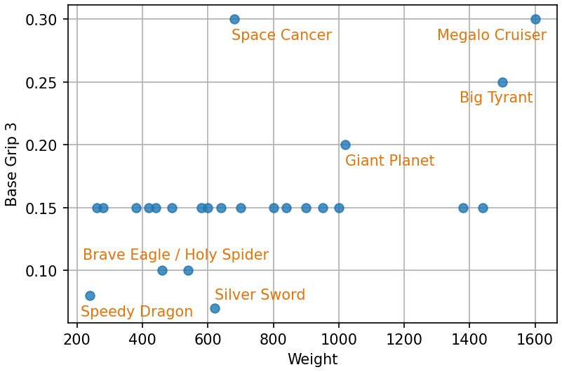

# Introduction
This document provides information on custom parts to make custom machines in F-ZERO GX. Since I am merely a Max Speed player, this document does not care the Snaking and Space Flying purposes.

## Resources about Basics
To learn about Max Speed run on F-ZERO GX, I recommend to read [AKC12's Max Speed Guide](https://docs.google.com/document/d/1yy1bv_G-eI2f7a8whAHOhhULii9DPPtTzrBExWm5sFk/edit?usp=sharing).

F-ZERO GX has many hidden stats of machines, and the [Machines' Internal Stats](https://docs.google.com/spreadsheets/d/133Xsq-KV3lpfk9SS4_L84WV-JuXHOR8_GlFZRnskkSU/edit?usp=sharing) spreadsheet summarizes the stats. You can check out a brief explanation about each stat in corresponding tabs. AKC12's [How Settings Affect Machine Attributes](https://docs.google.com/document/d/1HH_ch12IxEfvJVZqkMIwZWXViqTAlj2MIADKf5iywGg/edit?usp=sharing) is helpful to learn about how settings affect the stats. Since I would not like to repeat explanation about the stats, please refer them if you don't know the internal stats. Also, my [Machines' Measured Data](https://docs.google.com/spreadsheets/d/1zTDH3mCGQ6mU56ecvcxKCFhpnLVHexOsXU3RgALDyIU/edit#gid=1986508902) spreadsheet summarizes some measured speed data, which can be used as a reference.

The massive links of resources are available on [F-ZERO GX Ultimate Compendium](https://1drv.ms/x/s!AvP5s5nGBAx5gSBZ0hUhnGKcMVUB).

## Colors of Parts
The color means the category of the parts. The gold parts should not be called AX parts.

| Color | Category | Unlocked by |
| ---- | ---- | ---- |
| Green | GX | Grand Prix |
| Red / Pink | AX | Story |
| Yellow / Gold | Special | [Events](https://tcrf.net/F-Zero_GX/Regional_Differences#Exclusive_Custom_Parts) / [Cheat Codes](https://crazygamenerd.web.fc2.com/FZGX_SP_Machines.html) |

# Body
Body parts determine body strength (cockpits affect too), grip, strafing power and the majority of total weight. Some of the stats strongly correlated with weights, while some does not.

## Weight Correlated Stats
[Grip 1](https://docs.google.com/spreadsheets/d/133Xsq-KV3lpfk9SS4_L84WV-JuXHOR8_GlFZRnskkSU/edit#gid=1) (difficulty to lose grip) and [Body](https://docs.google.com/spreadsheets/d/133Xsq-KV3lpfk9SS4_L84WV-JuXHOR8_GlFZRnskkSU/edit#gid=10) are strongly correlated to body [Weight](https://docs.google.com/spreadsheets/d/133Xsq-KV3lpfk9SS4_L84WV-JuXHOR8_GlFZRnskkSU/edit#gid=607097756). The heavier the body part is, the higher the grip is, and the stronger the body is. According to my analysis, turning speed is strongly correlated with total Weight times the sum of the length parts of [Tilt](https://docs.google.com/spreadsheets/d/133Xsq-KV3lpfk9SS4_L84WV-JuXHOR8_GlFZRnskkSU/edit#gid=20). Therefore, the steering heaviness is correlated to Weight but slightly different from itself (mainly due to the difference of length). Note that, the actual ranks of steering heaviness can be changed by combined cockpit and booster parts. Steering heaviness shown in the following figure is calculated by , where  and  are body Weight, front length of Tilt, back length of Tilt and [Turn Tension](https://docs.google.com/spreadsheets/d/133Xsq-KV3lpfk9SS4_L84WV-JuXHOR8_GlFZRnskkSU/edit#gid=2), respectively.

By the correlation between Grip 1 and steering heaviness, the lighter the body is, the easier to lose grip is. The heavier the body is, the harder to lose grip is. However, the Grip 3 stat shown in the next section is also important for drivability. Also, non-custom machines do not have such a strong correlation between Weight and Grip 1 or Body. So, the strong correlation between body Weight and Grip 1 is only a one aspect of this game.

## Uncorrelated Stats
### Grip 3
[Grip 3](https://docs.google.com/spreadsheets/d/133Xsq-KV3lpfk9SS4_L84WV-JuXHOR8_GlFZRnskkSU/edit#gid=8) (negative slipperiness during a drift) is one of the most important stats which determines the drivability of the machine. Unlike Grip 1, Grip 3 of body parts are very weakly correlated to Weight. The majority of the body parts have 0.15 base Grip 3 (base means at 50% value, since it changes by settings). Bodies with lower Grip 3 are difficult to regain the grip, so that the drivability is lowered. Bodies with higher Grip 3 are difficult to continue drifting, so that the drivability is also lowered. I think, Giant Planet's Grip 3 is not too high in most cases, but Big Tyrant, Space Cancer and Megalo Cruiser are too sticky. Bodies with less than 0.1 base Grip 3 (Speedy Dragon and Silver Sword) are very difficult to control. Exact 0.1 base Grip 3 (Brave Eagle and Holy Spider) is slightly less drivable, but not too bad.

### Strafe
[Strafe](https://docs.google.com/spreadsheets/d/133Xsq-KV3lpfk9SS4_L84WV-JuXHOR8_GlFZRnskkSU/edit#gid=5) is also one of the most important stats of body parts. MTS ability is strongly correlated to this stat. Mostly, higher than or equal to 35 is good to MTS (the higher, the better). 30 can be decent, but apparently weaker. All the bodies with less than or equal to 25 Strafe value have very weak MTS ability. Also, the high Grip 3 bodies do not have good MTS ability even if Strafe stat is high (Megalo Cruiser). In the following figure, labels of "C rated" and "B rated" exclude directly labeled body parts.

# Cockpit
Cockpit parts determine turning ability, grip (other stat than body parts) and body strength (same as body parts). All the principal stats intermediately to strongly correlated to Weight.

## Turn Movement
[Turn Movement](https://docs.google.com/spreadsheets/d/133Xsq-KV3lpfk9SS4_L84WV-JuXHOR8_GlFZRnskkSU/edit#gid=3) is the most important stat of cockpit parts. It determines steering power. The higher the Turn Movement value is, the more sharply the machine turns. For the cockpit parts, the heavier the cockpit is, the higher Turn Movement is. Generally, the higher Turn Movement is, the better the machine performs. Therefore, Maximum Star, the heaviest and highest Turn Movement cockpit part is considered best in most cases. Also, this would be the main reason why Combat Cannon is considered second to the best cockpit.

Since the steering heaviness is also affected by total Weight, the Weight of cockpit itself is also important when the Weight of body plus booster is low. For example, if the cockpits are combined with Speedy Dragon and Titan G4, all the A, B and C rated cockpits has similar rotation speed during the stationary turn (Maximum Star is the fastest though). In contrast, if the cockpits are combined with Dread Hammer and Titan G4, the importance of Turn Movement is emphasized, in terms of rotation speed during the stationary turn.

A rated cockpits other than Maximum Star might have niche demands. At least, all the A and B rated cockpits are good enough for casual play. You can choose lighter cockpit down to B rated, in order to make the machine easier to control, if you feel heavier cockpits are too responsible.

C rated cockpits are not too bad if it is combined with B rated or lighter body part. Specially named customs with such combinations would be suitable for Grand Prix. D and E rated cockpits are always very bad, especially when they are combined with A rated body and A rated booster parts. Try such combinations if you want to see the [nightmare](https://youtu.be/09gfpoO1xdw) of this game. Machines with D or E rated cockpits are controllable if the body and booster are light enough, but they are definitely slower than heavier combinations.

## Strafe Turn, Grip 2 and Body
[Strafe Turn](https://docs.google.com/spreadsheets/d/133Xsq-KV3lpfk9SS4_L84WV-JuXHOR8_GlFZRnskkSU/edit#gid=4) and [Grip 2](https://docs.google.com/spreadsheets/d/133Xsq-KV3lpfk9SS4_L84WV-JuXHOR8_GlFZRnskkSU/edit#gid=7) are also affect turning. However, I'm not very sure about these stats. Since they are correlated with cockpit Weight, it is difficult to notice the effects of them distinguished from other stats. I'm curious to see how the highest Strafe Turn of Combat Cannon and the lowest Grip 2 of Crazy Buffalo will work.

Cockpits also have [Body](https://docs.google.com/spreadsheets/d/133Xsq-KV3lpfk9SS4_L84WV-JuXHOR8_GlFZRnskkSU/edit#gid=10) stat. The total Body stat of the custom machine is the product of body part's Body and cockpit part's Body stats. The value is the multiplier of the damage, so that the smaller, the better.

# Booster
Booster parts determine most of speed related properties, such as acceleration, top speed, booster strength and deceleration by steering, strafing and drifting. They are also affected by total Weight, but the stats of booster parts are the most important things. These speed related properties are determined by various internal stats via complex way. So, just looking the raw internal stats of booster parts brings you little understanding.

To be written.
