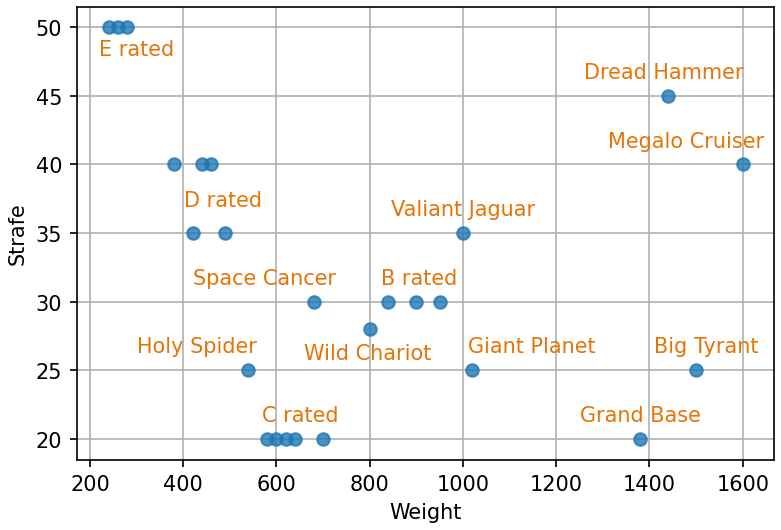

# Introduction
This document provides information on custom parts to make custom machines in F-ZERO GX. Since I am merely a Max Speed player, this document does not care the Snaking and Space Flying purposes.

## Resources about Basics
To learn about Max Speed run on F-ZERO GX, I recommend to read [AKC12's Max Speed Guide](https://docs.google.com/document/d/1yy1bv_G-eI2f7a8whAHOhhULii9DPPtTzrBExWm5sFk/edit?usp=sharing).

F-ZERO GX has many hidden stats of machines, and the [Machines' Internal Stats](https://docs.google.com/spreadsheets/d/133Xsq-KV3lpfk9SS4_L84WV-JuXHOR8_GlFZRnskkSU/edit?usp=sharing) spreadsheet summarizes the stats. You can check out a brief explanation about each stats in corresponding tabs. AKC12's [How Settings Affect Machine Attributes](https://docs.google.com/document/d/1HH_ch12IxEfvJVZqkMIwZWXViqTAlj2MIADKf5iywGg/edit?usp=sharing) is helpful to learn about how settings affect the stats. Since I would not like to repeat explanation about the stats, please refer them if you don't know the internal stats. Also, my [Machines' Measured Data](https://docs.google.com/spreadsheets/d/1zTDH3mCGQ6mU56ecvcxKCFhpnLVHexOsXU3RgALDyIU/edit#gid=1986508902) spreadsheet summarizes some measured speed data, which can be used as a reference.

The massive links of resources are available on [F-ZERO GX Ultimate Compendium](https://1drv.ms/x/s!AvP5s5nGBAx5gSBZ0hUhnGKcMVUB).

## Color of Parts
The color means the category of the parts. The gold parts should not be called AX parts.

| Color | Category | Unlocked by |
| ---- | ---- | ---- |
| Green | GX | Grand Prix |
| Red / Pink | AX | Story |
| Yellow / Gold | Special | [Events](https://tcrf.net/F-Zero_GX/Regional_Differences#Exclusive_Custom_Parts) / [Cheat Codes](https://crazygamenerd.web.fc2.com/FZGX_SP_Machines.html) |

# Body
Body parts determine body strength (cockpits affect too), grip, strafing power and the majority of total weight. Some of the stats strongly correlated with weights, while some does not.

## Weight Correlated Stats
[Grip 1](https://docs.google.com/spreadsheets/d/133Xsq-KV3lpfk9SS4_L84WV-JuXHOR8_GlFZRnskkSU/edit#gid=1) (difficulty to lose grip) and [Body](https://docs.google.com/spreadsheets/d/133Xsq-KV3lpfk9SS4_L84WV-JuXHOR8_GlFZRnskkSU/edit#gid=10) are strongly correlated to body [Weight](https://docs.google.com/spreadsheets/d/133Xsq-KV3lpfk9SS4_L84WV-JuXHOR8_GlFZRnskkSU/edit#gid=607097756). The heavier the body part is, the higher the grip is, and the stronger the body is. According to my analysis, turning speed is strongly correlated with total Weight times the sum of the length parts of [Tilt](https://docs.google.com/spreadsheets/d/133Xsq-KV3lpfk9SS4_L84WV-JuXHOR8_GlFZRnskkSU/edit#gid=20). Therefore, the steering heaviness is correlated to Weight but slightly different from itself (mainly due to the difference of length). Note that, the actual ranks of steering heaviness can be changed by combined cockpit and booster parts. Steering heaviness shown in the following figure is calculated by $w(l_\textrm{f}+l_\textrm{b})(0.024+t^{0.08})$, where $w, l_\textrm{f}, l_\textrm{b}$ and $t$ are body Weight, front length of Tilt, back length of Tilt and [Turn Tension](https://docs.google.com/spreadsheets/d/133Xsq-KV3lpfk9SS4_L84WV-JuXHOR8_GlFZRnskkSU/edit#gid=2), respectively.

By the correlation between Grip 1 and steering heaviness, the lighter the body is, the easier to lose grip is. The heavier the body is, the harder to lose grip is. However, the Grip 3 stat shown in the next section is also important for drivability. Also, non-custom machines do not have such a strong correlation between Weight and Grip 1 or Body. So the strong correlation between body Weight and Grip 1 is only a one aspect of this game.

## Uncorrelated Stats
### Grip 3
[Grip 3](https://docs.google.com/spreadsheets/d/133Xsq-KV3lpfk9SS4_L84WV-JuXHOR8_GlFZRnskkSU/edit#gid=8) (negative slipperiness during a drift) is one of the most important stats which determines the drivability of the machine. Unlike Grip 1, Grip 3 of body parts are very weakly correlated to Weight. The majority of the body parts have 0.15 base Grip 3 (base means at 50% value, since it changes by settings). Bodies with lower Grip 3 are difficult to regain the grip, so that the drivability is lowered. Bodies with higher Grip 3 are difficult to continue drifting, so that the drivability is also lowered. I think, Giant Planet's Grip 3 is not too high in most cases, but Big Tyrant, Space Cancer and Megalo Cruiser are too sticky. Bodies with less than 0.1 base Grip 3 are very difficult to control. Exact 0.1 base Grip 3 is slightly less drivable, but not too bad.

### Strafe
[Strafe](https://docs.google.com/spreadsheets/d/133Xsq-KV3lpfk9SS4_L84WV-JuXHOR8_GlFZRnskkSU/edit#gid=5) is also one of the most important stats of body parts. MTS ability is strongly correlated to this stat. Mostly, higher than or equal to 35 is good to MTS (the higher, the better). 30 can be decent, but apparently weaker. All the bodies with less than or equal to 25 Strafe value have very weak MTS ability. Also, the high Grip 3 bodies do not have good MTS ability even if Strafe stat is high (Megalo Cruiser). In the following figure, labels of "C rated" and "B rated" exclude directly labeled body parts.

# Cockpit
To be written.

# Booster
To be written.
