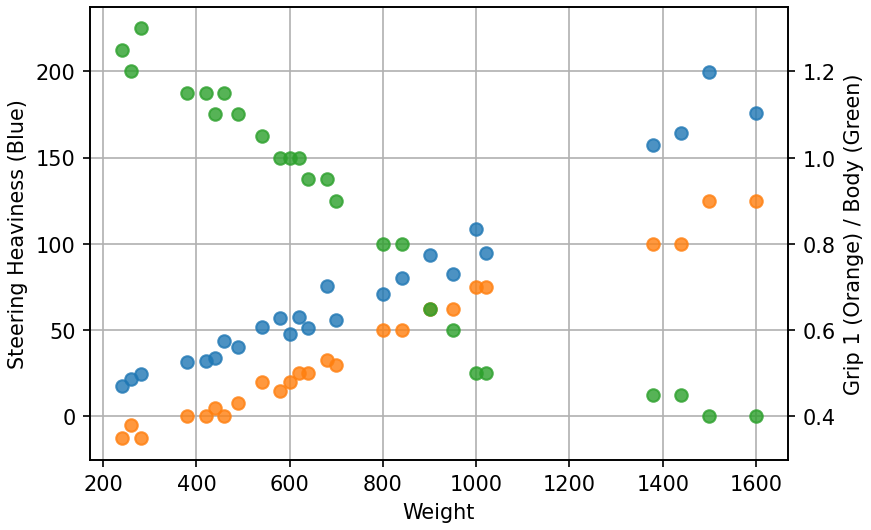

# Introduction
This document provides information on custom parts to make custom machines in F-ZERO GX. Since I am merely a Max Speed player, this document does not care the Snaking and Space Flying purposes.

## Resources about Basics
To learn about Max Speed run on F-ZERO GX, I recommend to read [AKC12's Max Speed Guide](https://docs.google.com/document/d/1yy1bv_G-eI2f7a8whAHOhhULii9DPPtTzrBExWm5sFk/edit?usp=sharing).

F-ZERO GX has many hidden stats of machines, and the [Machines' Internal Stats](https://docs.google.com/spreadsheets/d/133Xsq-KV3lpfk9SS4_L84WV-JuXHOR8_GlFZRnskkSU/edit?usp=sharing) spreadsheet summarizes the stats. You can check out a brief explanation about each stat in corresponding tabs. AKC12's [How Settings Affect Machine Attributes](https://docs.google.com/document/d/1HH_ch12IxEfvJVZqkMIwZWXViqTAlj2MIADKf5iywGg/edit?usp=sharing) is helpful to learn about how settings affect the stats. Since I would not like to repeat explanation about the stats, please refer them if you don't know the internal stats. Also, my [Machines' Measured Data](https://docs.google.com/spreadsheets/d/1zTDH3mCGQ6mU56ecvcxKCFhpnLVHexOsXU3RgALDyIU/edit#gid=1986508902) spreadsheet summarizes some measured speed data, which can be used as a reference.

[Differences Between the Best Custom Parts in F-ZERO GX](https://docs.google.com/document/d/1So9MZ92JoMX4xwp7kgXpuYVsbesTlfXCzQ3aKeAe1H8/edit?usp=sharing) have detailed discussions of top cockpits and top boosters. This document aims to complement it, so that you can see the overview of all the parts.

The massive links to resources are available on [F-ZERO GX Ultimate Compendium](https://1drv.ms/x/s!AvP5s5nGBAx5gSBZ0hUhnGKcMVUB).

## Colors of Parts
The color means the category of the parts. The gold parts should not be called AX parts.

| Color | Category | Unlocked by |
| ---- | ---- | ---- |
| Green | GX | [Grand Prix](https://www.mutecity.org/wiki/F-Zero_Shop#Custom_parts) |
| Red / Pink | AX | [(mostly) Story](https://www.mutecity.org/wiki/F-Zero_Shop#Custom_parts) |
| Yellow / Gold | Special | [Events](https://tcrf.net/F-Zero_GX/Regional_Differences#Exclusive_Custom_Parts) / [Cheat Codes](https://crazygamenerd.web.fc2.com/FZGX_SP_Machines.html) |

# Body
Body parts determine body strength (cockpits affect too), grip, strafing power and the majority of total weight. Some of the stats strongly correlated with weights, while some does not.

## Weight Correlated Stats
[Grip 1](https://docs.google.com/spreadsheets/d/133Xsq-KV3lpfk9SS4_L84WV-JuXHOR8_GlFZRnskkSU/edit#gid=1) (difficulty to lose grip) and [Body](https://docs.google.com/spreadsheets/d/133Xsq-KV3lpfk9SS4_L84WV-JuXHOR8_GlFZRnskkSU/edit#gid=10) are strongly correlated to body [Weight](https://docs.google.com/spreadsheets/d/133Xsq-KV3lpfk9SS4_L84WV-JuXHOR8_GlFZRnskkSU/edit#gid=607097756). The heavier the body part is, the higher the grip is, and the stronger the body is. According to my analysis, rotation speed during a stationary turn is strongly correlated with total Weight times the sum of the length parts of [Tilt](https://docs.google.com/spreadsheets/d/133Xsq-KV3lpfk9SS4_L84WV-JuXHOR8_GlFZRnskkSU/edit#gid=20). Therefore, the steering heaviness is correlated to Weight but slightly different from itself (mainly due to the difference of length). Note that, the actual ranks of steering heaviness can be changed by combined cockpit and booster parts. Steering heaviness shown in the following figure is calculated by , where  and  are body Weight, front length of Tilt, back length of Tilt and [Turn Tension](https://docs.google.com/spreadsheets/d/133Xsq-KV3lpfk9SS4_L84WV-JuXHOR8_GlFZRnskkSU/edit#gid=2), respectively.

By the correlation between Grip 1 and steering heaviness, the lighter the body is, the easier to lose grip is. The heavier the body is, the harder to lose grip is. However, the Grip 3 stat shown in the next section is also important for drivability. Also, non-custom machines do not have such a strong correlation between Weight and Grip 1 or Body. So, the strong correlation between body Weight and Grip 1 is only a one aspect of this game.

## Uncorrelated Stats
### Grip 3
[Grip 3](https://docs.google.com/spreadsheets/d/133Xsq-KV3lpfk9SS4_L84WV-JuXHOR8_GlFZRnskkSU/edit#gid=8) (negative slipperiness during a drift) is one of the most important stats which determines the drivability of the machine. Unlike Grip 1, Grip 3 of body parts are very weakly correlated to Weight. The majority of the body parts have 0.15 base Grip 3 (base means at 50% value, since it changes by settings). Bodies with lower Grip 3 are difficult to regain the grip, so that the drivability is lowered. Bodies with higher Grip 3 are difficult to continue drifting, so that the drivability is also lowered. I think, Space Cancer and Giant Planet's Grip 3 is not too high in most cases, but Big Tyrant and Megalo Cruiser are too sticky. Bodies with less than 0.1 base Grip 3 (Speedy Dragon and Silver Sword) are very difficult to control. Exact 0.1 base Grip 3 bodies (Brave Eagle and Holy Spider) are slightly less drivable, but not too bad.

### Strafe
[Strafe](https://docs.google.com/spreadsheets/d/133Xsq-KV3lpfk9SS4_L84WV-JuXHOR8_GlFZRnskkSU/edit#gid=5) is also one of the most important stats of body parts. MTS ability is strongly correlated to this stat. Mostly, higher than or equal to 35 is good to MTS (the higher, the better). 30 can be decent, but apparently weaker. All the bodies with less than or equal to 25 Strafe value have very weak MTS ability. Also, the high Grip 3 bodies do not have good MTS ability even if Strafe stat is high (Megalo Cruiser). In the following figure, labels of "C rated" and "B rated" exclude directly labeled body parts.

# Cockpit
Cockpit parts determine turning ability, grip (other stat than body parts) and body strength (same as body parts). All the principal stats intermediately to strongly correlated to Weight.

## Turn Movement
[Turn Movement](https://docs.google.com/spreadsheets/d/133Xsq-KV3lpfk9SS4_L84WV-JuXHOR8_GlFZRnskkSU/edit#gid=3) is the most important stat of cockpit parts. It determines steering power. The higher the Turn Movement value is, the more sharply the machine turns. For the cockpit parts, the heavier the cockpit is, the higher Turn Movement is. Generally, the higher Turn Movement is, the better the machine performs. Therefore, Maximum Star, the heaviest and highest Turn Movement cockpit part is considered best in most cases. Also, this would be the main reason why Combat Cannon is considered second to the best cockpit.

Since the steering heaviness is also affected by total Weight, the Weight of cockpit itself is also important when the Weight of body plus booster is low. For example, if the cockpits are combined with Speedy Dragon and Titan G4, all the A, B and C rated cockpits has similar rotation speed during a stationary turn (Maximum Star is the fastest though). In contrast, if the cockpits are combined with Dread Hammer and Titan G4, the importance of Turn Movement is emphasized, in terms of rotation speed during a stationary turn.

A rated cockpits other than Maximum Star might have niche demands. At least, all the A and B rated cockpits are good enough for casual play. You can choose lighter cockpit down to B rated, in order to make the machine easier to control, if you feel heavier cockpits are too responsible.

C rated cockpits are not too bad if it is combined with B rated or lighter body part. Specially named customs with such combinations would be suitable for Grand Prix (e.g. Beat the Beast). D and E rated cockpits are always very bad, especially when they are combined with A rated body and A rated booster parts. Try such combinations if you want to see the [nightmare](https://youtu.be/09gfpoO1xdw) of this game. Machines with D or E rated cockpits are controllable if body and booster parts are light enough, but they are definitely slower than heavier combinations.

## Strafe Turn, Grip 2 and Body
[Strafe Turn](https://docs.google.com/spreadsheets/d/133Xsq-KV3lpfk9SS4_L84WV-JuXHOR8_GlFZRnskkSU/edit#gid=4) and [Grip 2](https://docs.google.com/spreadsheets/d/133Xsq-KV3lpfk9SS4_L84WV-JuXHOR8_GlFZRnskkSU/edit#gid=7) also affect turning. However, I'm not very sure about these stats. Since they are correlated with cockpit Weight, it is difficult to notice the effects of them distinguished from other stats. I'm curious to see how the highest Strafe Turn of Combat Cannon and the lowest Grip 2 of Crazy Buffalo will work.

Cockpits also have [Body](https://docs.google.com/spreadsheets/d/133Xsq-KV3lpfk9SS4_L84WV-JuXHOR8_GlFZRnskkSU/edit#gid=10) stat. The total Body stat of the custom machine is the product of body part's Body and cockpit part's Body stats. The value is the multiplier of the damage, so that the smaller, the more durable.

# Booster
Booster parts determine most of speed related properties, such as acceleration, top speed, booster strength and deceleration by steering, strafing and drifting. They are also affected by total Weight, but the stats of booster parts are the most important things. These speed related properties are determined by various internal stats via complex way. So, just looking the raw internal stats of booster parts brings you little understanding.

To be written.

# I'm a beginner. Which custom machine is recommended?
The top tier machines like Quick Star-G4 are not good for players with less skills. However, there are slower than top tier but much easier to control custom machines, which make it easy to beat the Grand Prix on Master Class. I listed the following parts as recommendation. Try to find your favorite combination. In the followings, the section title means "Part Name / Unlocking Condition / Recommendation Level." I set the recommendation levels as follows.

| Level | Description |
| :----: | ---- |
| \*\*\* | Good for the first choice. |
| \*\* | Try them if you feel the above to be not for you. |
| \* | I don't strongly recommend them, but some players might feel them to be better than above. |

## Body
Lighter bodies have sharper turn, but have less grip. So, it's difficult to guess which is the best for you.

### Aqua Goose / Available from the start / \*\*\*
Aqua Goose has good balance of grip, turning ability and weight. It is also easy to control on Pipe / Cylinder. I think this is the best for the first choice.

### Funny Swallow / Available without purchase / \*\*\*
Funny Swallow is a lighter alternative for the first choice. It can turn most curves without drifting, but has less grip than Aqua Goose. Also, this is easy to control on Pipe / Cylinder, too.

### Brave Eagle / Win the Diamond Cup on Expert Class / \*\*
If you want lighter body, Brave Eagle is good. But its grip would be too low for beginners.

### Rage Knight / Cheat code / \*\*
Rage Knight is similar to Funny Swallow. It has less controllability on Pipe / Cylinder, but otherwise, it would be slightly better than Funny Swallow.

### Blood Raven / Cheat code / \*\*
Blood Raven has intermediate weight between Aqua Goose and Funny Swallow, and has good balance of turning and grip. A small flaw of this is slightly less controllable on Pipe / Cylinder than Aqua Goose and Funny Swallow.

### Sky Horse / Available from the start / \*\*, Rapid Barrel / Win a Grand Prix on any Class / \*\*
These are also intermediate alternatives. Nothing special to say, but you might like them.

### Mad Bull / Cheat code / \*\*
Mad Bull is a heavier alternative with good balance.

### Valiant Jaguar / Win a Grand Prix on any Class / \*\*
If you want heavier than Fire Wolf and Mad Bull bodies, Valiant Jaguar is an alternative. It's heavy but has good balance. It is also good on Pipe / Cylinder.

### Giant Planet / Complete Chapter 4 on Hard / \*\*
Giant Planet has similar weight as Valiant Jaguar and much higher grip. If you want very high grip, Giant Planet is an alternative. It is also good on Pipe / Cylinder.

### Space Cancer / Complete Chapter 6 on Hard / \*
Space Cancer is a lighter variant of Giant Planet. If you want very high grip and relatively good turning, try this.

### Fire Wolf / Available from the start / \*, Metal Shell / Cheat code / \*
Fire Wolf and Metal Shell are alternatives of Mad Bull. Fire Wolf is unstable on Pipe / Cylinder and Metal Shell has some awkward responsibility, but you might like them. To be honest, I like Metal Shell.

### Dread Hammer / Complete Chapter 8 on Hard / \*
Dread Hammer is a body part of Gallant Star-G4, one of the top tier customs. It's too heavy for beginners, but you might feel not so bad. Also, Dread Hammer is hard to control on Pipe / Cylinder.

### Grand Base / Available from the start / \*
Grand Base is similar to Dread Hammer except two things. It has very weak MTS ability but good controllability on Pipe / Cylinder, in contrast to Dread Hammer. It would also be too heavy for beginners.

### Optical Wing / Complete Chapter 2 on Hard / \*, Splash Whale / Complete Chapter 9 on Hard / \*, Galaxy Falcon / Cheat code / \*
If you want lighter body than Brave Eagle, these are alternatives. They have too low grip for beginners, but easier to control than Speedy Dragon.

## Cockpit
Generally, heavier cockpits are good for most circumstances. You can chose lighter ones if you want less responsibility in steering.

### Maximum Star / Cheat code / \*\*\*
Maximum Star is the best cockpit for most circumstances. The big flaw of this is that it is an event part.

### Combat Cannon / Complete Chapter 7 on Hard / \*\*\*
Combat Cannon is the closest cockpit to Maximum Star. It has slightly different responsibility and is slightly slower in turning techs, but it is very close to Maximum Star.

### Heat Snake / Complet Chapter 3 on Hard / \*\*
If you want much less responsibility, this is the best alternative.

### Spark Bird / Complete Chapter 6 on Hard / \*\*
One of the good lighter alternatives. It has intermediate stats between Combat Cannon and Heat Snake.

### Other A or B rated cockpits / Depends on parts / \*
You can chose any of A or B rated cockpits if you feel the above to be not for you. And yet, lighter than B rated are not recommended.

## Booster
### Titan G4 / Win a Grand Prix on any Class / \*\*\*
I highly recommend Titan G4 for booster. It has highest unboosted top speed and decent acceleration, that makes it good on most circumstances.

### Heavier than Titan G4 boosters / Depends on parts / \*
They are faster in some situations if the player has high enough skills. But I don't recommend them for beginners.

# How do I make the "worst" custom machine?
There are no machines which can be said worst in all aspects. However, I think, there are two big groups which can be said worst: bad turning machines and the slowest machines. I think, most players would feel the former group should be said the worst, however, they are faster than the latter group in some situations, such as time attack on CTT.

## Worst in terms of Turning
Generally, the heavier body and booster are and the lighter cockpit is, the worse machine is in terms of turning. Machines with A rated body and booster, and E or D rated cockpit are literally unable to turn at all. By some reasons, it is hard to determine which is the true worst among them. The following shows the parts of the alternatives.

### Big Tyrant
Big Tyrant is the "heaviest" body part in terms of steering, although it is lighter than Megalo Cruiser in terms of Weight. So, this part is the first alternative for body part of the worst turning group. Big Tyrant also have high grip, so that machines with this is hard to drift.

### Megalo Cruiser
Megalo Cruiser is the second alternative for body part. It is lighter in terms of steering, but has higher grip than Big Tyrant. That means, machines with Megalo Cruiser are slightly harder to keep drifting. Since machines of this group need to lose grip in order to turn, higher grip makes the machine worse. Though, even Big Tyrant with light cockpit is too hard to drift.

### Windy Shark
Windy Shark has the worst steering ability. I think, this is the worst cockpit in general.

### Aerial Bullet
Aerial Bullet has the highest Grip 2 stat. So, machines with this cockpit part seem to turn slightly slower than those with Windy Shark, during a drift. I cannot determine which is true worse, but definetly this is one of the worst cockpits.

### Thunderbolt V2
Booster part affects turning ability by its Weight, so that the heaviest booster, namely, Thunderbolt V2 is the worst in terms of this aspect.

## Worst in terms of Speed
Bluster X is the slowest booster part, in almost all aspects. Again, Windy Shark and Aerial Bullet have almost no reasons to be fast. So I think, machines with these booster and cockpit parts should be in this group. However, since all body parts have strong and weak points, I cannot determine which is the true worst. I listed notable ones as follows.

### Speedy Dragon
Speedy Dragon is the lightest and one of the most slippery body part. Due to its Weight, machines with this body part have slowest unboosted top speed. However, it has strongest MTS ability. It is fast in MTS even with Bluster X and Windy Shark or Aerial Bullet. Despite the MTS ability, this part should be listed because of its Weight and difficulty to control.

### Holy Spider
Holy Spider is the lightest body part which has no good MTS ability. Holy Spider is slightly too slippery to be easy to control too. I think, this body part has least strong points.

### Space Cancer
Space Cancer is the lightest body part with high grip. Space Cancer is too grippy to control and not fast because it is not heavy. This body part has almost no strong points, but at least, it is heavier than Holy Spider.

### Silver Sword
Silver Sword is one of the most slippery body part. Unlike Speedy Dragon, this part has no good MTS ability. Machines with this body part are difficult to control and not fast.

### Big Tyrant
The worst turning ability makes the machine slow on courses with tight curves. Therefore, this should be listed here. However, due to its Weight, it is fast on such as CTT and ADS.

## Worst Among Specially Named Customs
Big Ace (Megalo Cruiser + Rave Drifter + Meteor RR) and Nightmare (Grand Base + Aerial Bullet + Thunderbolt V2) are in the former group and Super Nova (Giant Planet + Rave Drifter + Bluster X) is in the latter group.

There are many sub-worst turning: Desert Camel, High Roller, Hippopotamus, Leviathan, Muscle Empress, Poseidon, Sockdolager and Strong Gustav. However, all of them are better than Big Ace and Nightmare.
